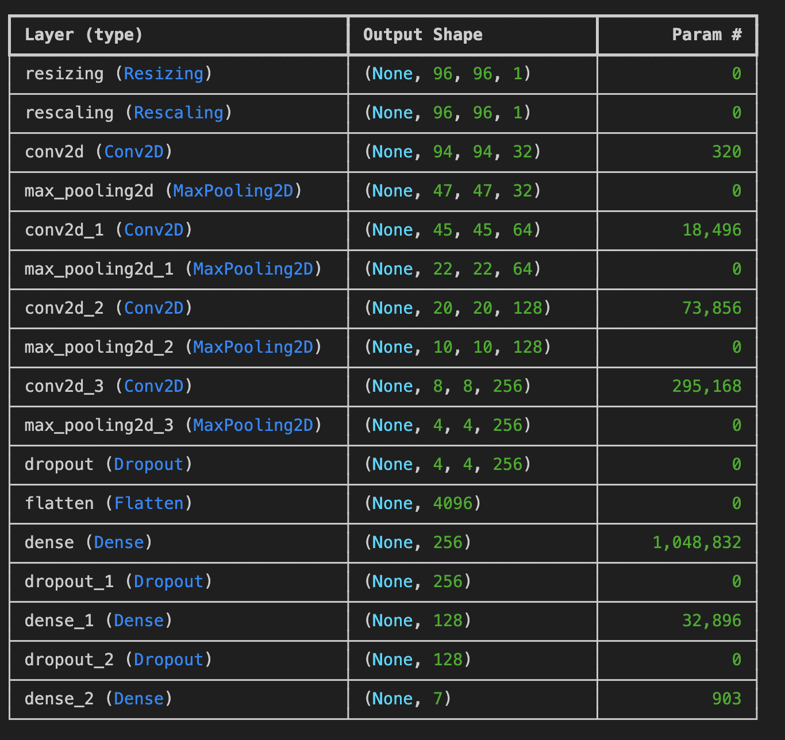

# Facial Emotion Detection with Keras  

This project performs **facial emotion recognition** by classifying images into seven categories: **Angry, Disgust, Fear, Happy, Sad, Surprise, and Neutral**.  

It is trained on the [FER2013 dataset](https://www.kaggle.com/datasets/msambare/fer2013) (grayscale faces at 48×48 resolution) and combines [`OpenCV`](https://opencv.org/) for real-time face detection with a `Tkinter` application that displays the predicted emotions in Spanish.  

The classification model is implemented as a **Convolutional Neural Network (CNN)** using [`Keras`](https://keras.io/).  

**Demo:**  

<p align="center">
  
</p>

--- 

## Usage  

Run the application locally to start real-time facial emotion detection.  
The program will open your webcam, detect faces using `OpenCV`, and display the predicted emotions in Spanish through a simple `Tkinter` interface.  

   ```bash
   git clone https://github.com/gandpablo/Facial-Emotion-Detection-Keras
   cd Facial-Emotion-Detection-Keras
   pip install -r requirements.txt
   cd app
   python app.py
   ```

---

## Project Structure  

The project includes the trained model saved as `.keras`, a Jupyter notebook (`model_trainingCNN.ipynb`) showing the training process, an `app/` folder with the Tkinter + OpenCV application, and `data/` with example images for quick testing. Additional folders like `training/` and `images/` contain experiments and demo material used in the README.  

```
Facial-Emotion-Detection-Keras/
│
├── app/
│   ├── __init__.py
│   ├── app.py
│   └── detector.py
│
├── data/
│   ├── em-testing/
│   │   └── ...
│   └── model/
│       └── modelo_fer2013.keras
│
├── example/
│   └── proof.ipynb
│
├── images/
│
├── training/
│   └── model_trainingCNN.ipynb
│
├── requirements.txt
├── README.md
└── .gitignore
```

---

## Dataset  

The model is trained on the [FER2013 dataset](https://www.kaggle.com/datasets/msambare/fer2013), originally introduced in the 2013 Kaggle Facial Expression Recognition Challenge. It contains **35,887 grayscale images of human faces**, each with a resolution of **48×48 pixels**.  

- **Training set:** 28,709 images  
- **Public test set:** 3,589 images  
- **Private test set:** 3,589 images  

Each image is labeled with one of the seven target emotions: **Angry, Disgust, Fear, Happy, Sad, Surprise, Neutral**.  

---

## Training  

To address the strong **class imbalance**, `class weights` were applied so that minority classes had more impact during training. Images were resized (96×96 and 144×144) and enriched with **data augmentation** (flips, rotations, zooms) to increase variability and help the model generalize better.  

The architecture is a **CNN** with stacked `Conv2D` + `MaxPooling` blocks, followed by `Dropout` and dense layers with `Softmax`. Regularization through `Dropout`, `EarlyStopping`, and learning-rate scheduling was key to **avoiding overfitting**.  

  

**Setup:**  
- Optimizer: `Adam` (`lr=1e-4`)  
- Loss: categorical cross-entropy  
- Regularization: `Dropout`, class weights, data augmentation  
- Callbacks: `EarlyStopping`, learning-rate scheduling  

**Results:**  
- Accuracy: ~**60%** on the test set — but the model performs **incredibly well in real-world tests**  
- Macro F1-score: ~**0.58**  
- Strongest on **Happy** and **Surprise**, weaker on **Disgust**, **Fear**, and **Sad** due to imbalance and subtle expressions.  


